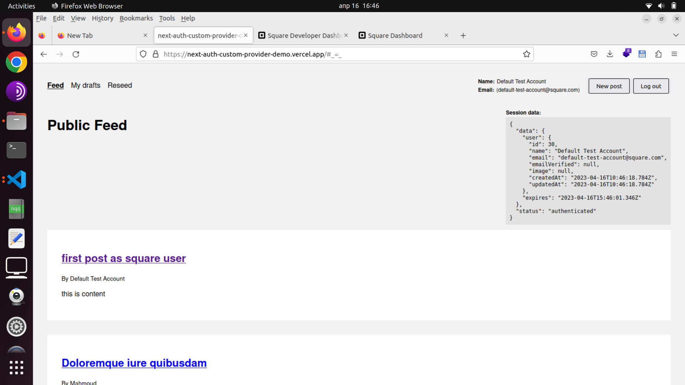
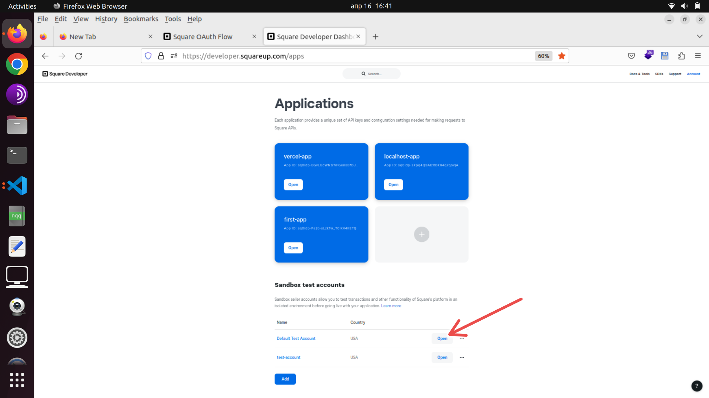

# Next-auth custom provider demo

Demo app for Next-auth custom provider using https://squareup.com OAuth provider. Provider implementation is in `lib/providers/square.ts`. Login is fully functional and uses sandbox test account, you must login with provided test account into Square dashboard and open `Default Test Account` in another tab and then you can test the login with Square in the demo.

Demo allows login with Square, creating, publishing and deleting posts, and reseeding database for another test. It is hosted on Vercel and uses external Postgres database on separate server. It must use low latency database or login will time out and throw error.

**Demo link: https://next-auth-custom-provider-demo.vercel.app**

There are also custom provider implementations for Uber and Yelp in `lib/providers/` but they are untested and incomplete, Uber doesn't allow `profile` scope for unverified apps (even though docs states opposite) and Yelp doesn't support Serbia for business accounts.

## Successful login with Square screenshot



## How to test the demo

1. Go to https://developer.squareup.com/apps and sign in with provided email and password for test account
2. Click `Open` button right from `Default Test Account`, it will lead to https://squareupsandbox.com/dashboard/ and keep that tab open while testing
3. You can now sign in with that account in the demo https://next-auth-custom-provider-demo.vercel.app



## Useful Square OAuth references

Official Next.js Prisma example that is used as a starting template:

- https://github.com/prisma/prisma-examples/tree/latest/typescript/rest-nextjs-api-routes-auth

Main OAuth example code:

- https://github.dev/square/connect-api-examples/tree/master/connect-examples/oauth/node

Get merchant profile:

- https://developer.squareup.com/reference/square/merchants-api/retrieve-merchant

Next-auth example for `token` and `userinfo` callbacks:

- https://stackoverflow.com/questions/73345086/next-auth-custom-provider-oidc-nonce-check

Next-auth OAuth docs:

- https://next-auth.js.org/configuration/providers/oauth#userinfo-option

Next-auth provider examples:

- https://github.com/nextauthjs/next-auth/tree/main/packages/next-auth/src/providers

## Running locally

Supply the following environment variables in `.env.development.local`:

```bash
SECRET=RANDOM_STRING

# local docker db
POSTGRES_HOSTNAME=localhost
POSTGRES_PORT=5432
POSTGRES_USER=postgres_user
POSTGRES_PASSWORD=password
POSTGRES_DB=cp-db-dev

# db url for the app
DATABASE_URL=postgresql://${POSTGRES_USER}:${POSTGRES_PASSWORD}@${POSTGRES_HOSTNAME}:${POSTGRES_PORT}/${POSTGRES_DB}?schema=public

# Square
SQUARE_APPLICATION_ID=
SQUARE_APPLICATION_SECRET=
SQUARE_ENVIRONMENT=sandbox
```

Then run:

```bash
# install dependencies
yarn install

# start Postgres database in Docker
docker compose up -d

# migrate database (must pass env vars)
yarn prisma:migrate:dev:env

# seed database (must pass env vars)
yarn prisma:seed:dev:env

# run the app in dev mode
yarn dev
```

## Uber references

`https://api.uber.com/v1.2/me` api is not possible to call without `profile` scope which is unavailable for unverified apps

- https://developer.uber.com/docs/riders/references/api/v1.2/me-get
- https://github.com/shernshiou/node-uber#me

Not true in my experience:

> The good news is you currently have access to these scopes when authorizing your own account or those of the developer accounts you list in your application dashboard (Limited Access). This allows you to start building an app immediately.

- https://developer.uber.com/docs/riders/guides/scopes

## Yelp references

Must use business use account for test and for register Serbia isn't an option in dropdown.

Useful docs links:

- https://docs.developer.yelp.com/docs/authorization-code-workflow

Get user endpoint:

- https://docs.developer.yelp.com/reference/oauth2_token
